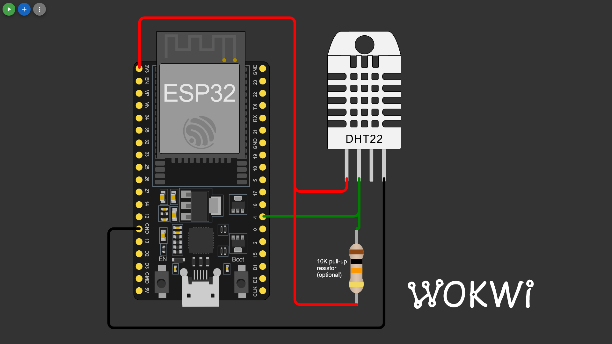
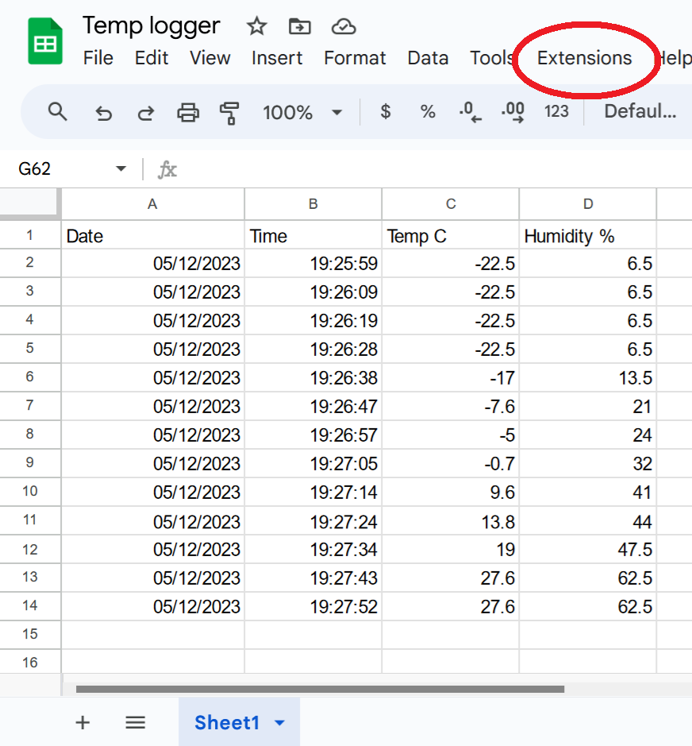

# ESP32 DHT22 Google Sheets logger
Log temperature and humidity to [Google Sheets](https://docs.google.com/spreadsheets/) using [Google Apps Script](https://www.google.com/script/start/), ESP32 and DHT11/DHT22 module





IMPORTANT!! For simulation to work in [Wokwi](https://wokwi.com/) add:
````
"attrs": { "fastTLS": "1" }
````
in diagram.json for the esp board.
